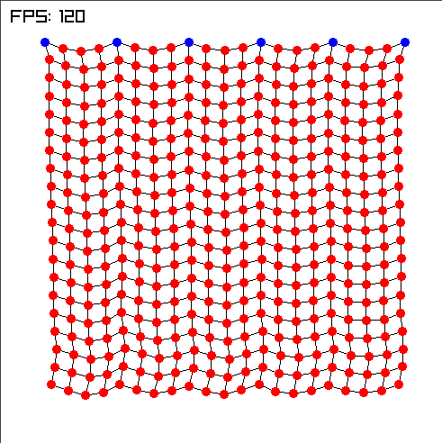

# Cloth Simulator

This is a very basic cloth simulation using [raylib-rs](https://github.com/deltaphc/raylib-rs) and [Verlet Integration](https://en.wikipedia.org/wiki/Verlet_integration).

# Notes
- most variables are currently hardcoded, you can change them in `src/main.rs`
- you can cut the simulated cloth by holding down the left mouse button.
- If you use NixOS, you can use the shell.nix by running `shell-nix` or direnv by running `direnv allow`.
- on NixOS, you might need something like [NixGL](https://github.com/guibou/nixGL) for running this binary. I put a small script in `bin`, that is added to path if you use direnv.